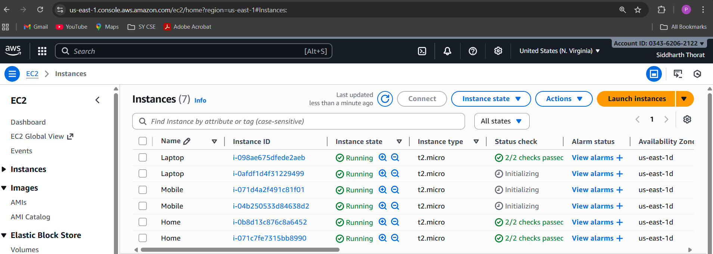
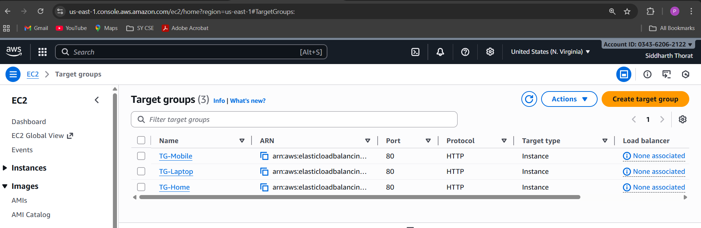
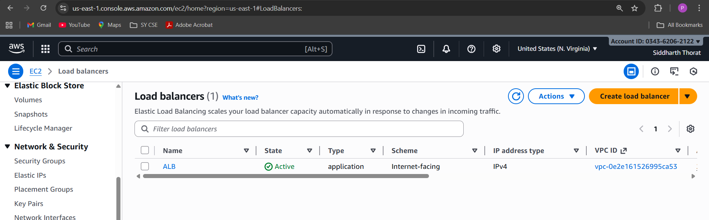
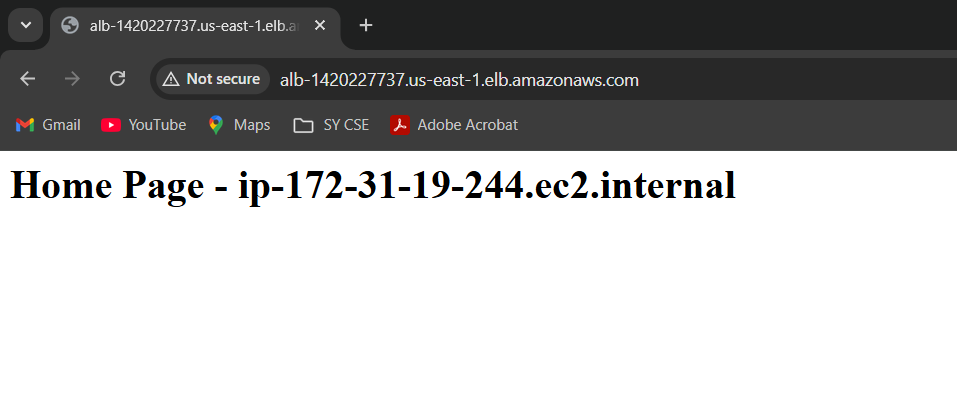
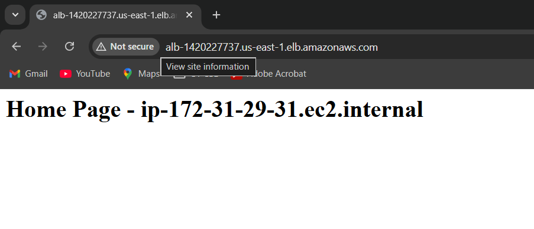
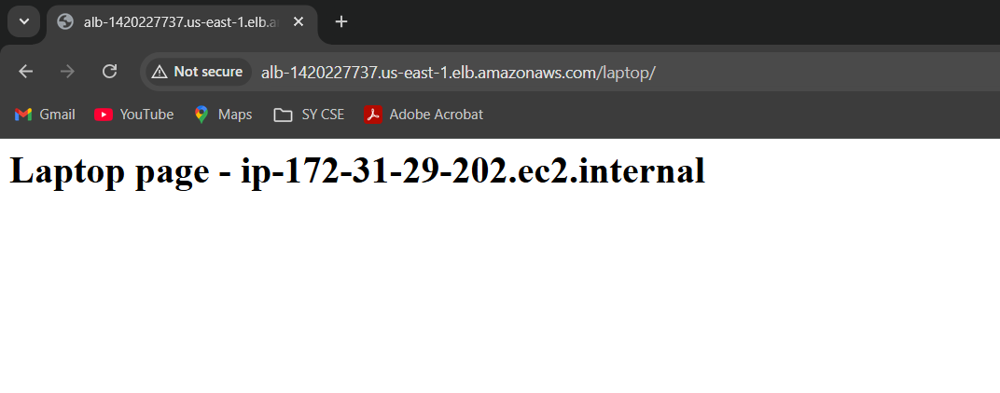
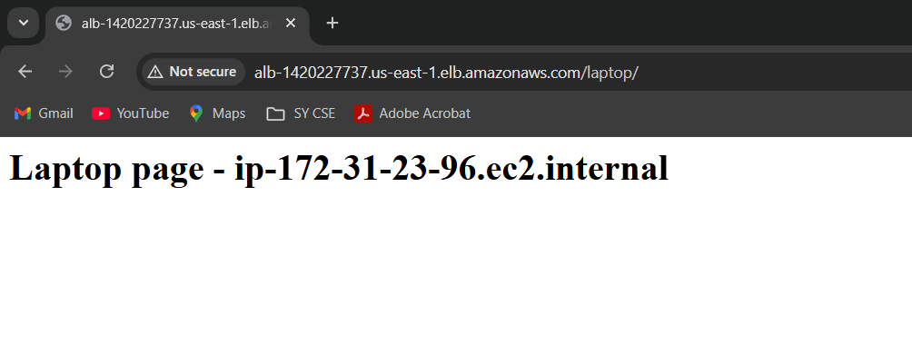
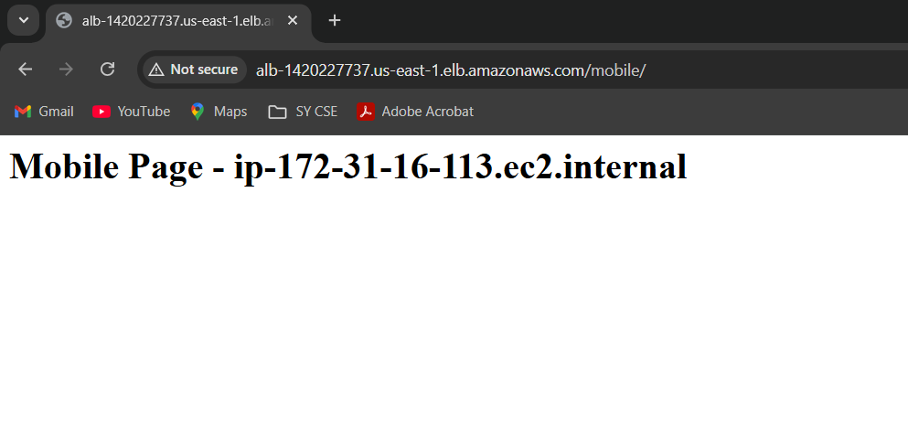
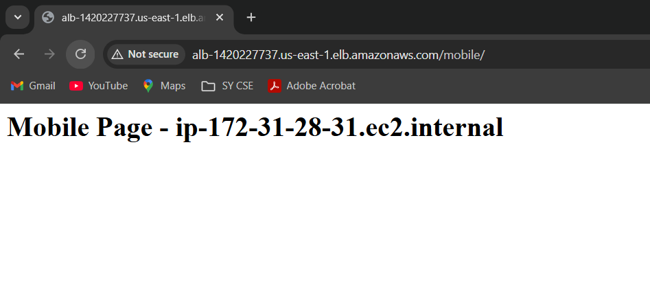

# Application Load Balancer with Multiple EC2 Instances

A complete AWS project demonstrating high availability, scalability, and fault-tolerant architecture using an Application Load Balancer (ALB) and multiple EC2 instances serving different pages.

## Project Overview

This project showcases how AWS ALB distributes traffic across six EC2 instances, each serving different pages:

| Page         | EC2 Instances |
| -----------  | ------------- |
| Home Page    | 2             |
| Laptop Page  | 2             |
| Mobile Page  | 2             |


The ALB routes traffic efficiently ensuring load distribution, fault tolerance, and smooth user experience.


## Technologies Used

- Amazon EC2
- Application Load Balancer (ALB)
- Target Groups
- Security Groups
- User Data Script (Apache Web Server)

## Step-by-Step Deployment

### Step 1: Launch EC2 Instances

You will create 6 EC2 instances (2 for each page).

### A. Launch Home Page Instances
1. Go to EC2 → Launch Instance
2. Set name: Home
3. Select Amazon Linux AMI
4. Choose key pair
5. Scroll to Advanced Details → User Data
6. Use this script (example):

```bash
#!/bin/bash
yum update -y
yum install httpd -y
systemctl start httpd
systemctl enable httpd
echo "<h1>Home Page - $(hostname)</h1>" > /var/www/html/index.html
```
7. Set Number of Instances = 2
8. Launch instances

### B. Launch Laptop Page Instances
- Repeat the same steps with:
- Name: Laptop
- User Data (update the content):
```bash
mkdir /var/www/html/laptop
echo "<h1>Laptop Page - $(hostname)</h1>" > /var/www/html/laptop/index.html
```
Launch 2 instance

### C. Launch Mobile Page Instances
- Repeat again with:
- Name: Mobile
- User Data:
```bash
mkdir /var/www/html/mobile
echo "<h1>Mobile Page - $(hostname)</h1>" > /var/www/html/mobile/index.html
```
Launch 2 instances.

✔️ Total instances running: 6



### Step 2: Create Target Groups 

- Create 3 Target Groups:
- In laptop target group edit health check path and add `/laptop`
- And in mobile target group add `/mobile`

| Target Group      | Contains                 |
| ------------      | ------------------------ |
| TG-Home           | For 2 Home EC2 instances   |
| TG-Laptop         | For 2 Laptop EC2 instances |
| TG-Mobile         | For 2 Mobile EC2 instances |

- Register respective instances to each group.


  
 ### Step 3: Create Application Load Balancer

1. EC2 → Load Balancers → Create Application Load Balancer

2. Choose:
- Internet-facing
- HTTP (Port 80)
3. In routing action select forward to target group and add TG-Home target group

4. In listeners and rule add rule for laptop and mobile add conditions and TG-laptop and TG-Mobile target group
 

 ### Step 4: Test the Setup
1. Copy ALB DNS name
2. Open in Browser and you will see Home page 
3. add `/laptop/` in ALB DNS name and you will see laptop page 
4. add `/mobile/` in ALB DNS name and you will see mobile page
5. Each response changes based on load balancing.

### Expected Output

Home Page Output





Laptop Page Output





Mobile Page Output






### Summary

This Project demonstrate Deployed an AWS Application Load Balancer to distribute traffic across three
Amazon Linux EC2 instances(Home, Laptop, Mobile). Each instance uses a User Data script with yum update to
install and start Apache, then serve a custom HTML page showing its hostname. The ALB listener on HTTP (80)
forwards requests to three target groups, delivering balanced responses from all servers.
